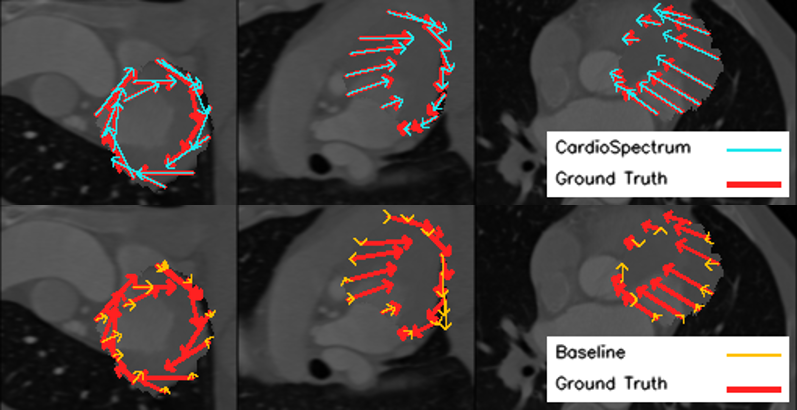

# CardioSpectrum: Comprehensive Myocardium Motion Analysis with 3D Deep Learning and Geometric Insights (MICCAI 2024)


Official implementation of [CardioSpectrum](Link). Visit our [project page](https://shaharzuler.github.io/CardioSpectrumPage/) for more details and updates.

This repository contains the complete optimization and evaluation process for CardioSpectrum. Given a 3D array representing a 3D cardio CT scan during systole, along with segmentations for the left ventricle (LV) and the myocardium, the program generates a synthetic diastole frame and optimizes CardioSpectrum.



## CardioSpectrum Architenture:


## Installation:

```bash
pip install -r requirements.txt
pip install git+https://github.com/RobinMagnet/pyFM.git 
```

## How to Run

### Inference

To run inference with the sample data, execute the script:

```bash
python infer.py
```

The output consists of a 3D NumPy array representing the 3D optical flow and a visual representation.


The predicted flow output will be saved at  
```sample_scan/output/outputs_[date_and_time]/for_drawing/pred_flow.npy```   
and the visualized 3 sections at
```sample_scan/output/outputs_[date_and_time]/for_drawing/w_constraints_pred_vs_gt.png```

Numerical and visual logs can be found at ```sample_scan/output/outputs_[date_and_time]/outputs_[method]_training_[date_and_time]/complete_summary```

<br>


To run the program with **your own data**, add your files to the `sample_scan/data` directory and adjust the file paths in `configs/general_config_template.json` accordingly.

### Evaluation

To run evaluation over a single data sample, execute the script:

```bash
python eval.py
```

All calculated evaluation data will be written to ```sample_scan/output/outputs_[date_and_time]/errors.json```


To run evaluation using numerous data samples and/or synthetic data parameters, follow these steps:
1. Generate different JSON configuration files for all experiments. You can use `exp_managing/json_generator.py` to automatically do so.

2. Run 
    ```bash
    python eval.py --config_path path/to/config
    ```
    for all config files.

3. Carefully adjust all paths, sample names, and parameters in `exp_managing/analysis/exp_analyzing.py` and `exp_managing/analysis/utils/exp_paths.json`, then run 
    ```bash
    python exp_managing/analysis/exp_analyzing.py
    ```

    The output is a dataframe collecting all metrics along with plots representing different errors.

    


The code was tested on a single Quadro RTX 8000 GPU, using CUDA version 10.2 and Python version 3.8.0.

The provided sample scan is the cardio CT scan originally from [3D Slicer](https://www.slicer.org/) sample data.


## Citing
If you find this repository helpful, please cite our publication.

arXiv preprint:
```
@misc{zuler2024cardiospectrumcomprehensivemyocardiummotion,
      title={CardioSpectrum: Comprehensive Myocardium Motion Analysis with 3D Deep Learning and Geometric Insights}, 
      author={Shahar Zuler and Shai Tejman-Yarden and Dan Raviv},
      year={2024},
      eprint={2407.03794},
      archivePrefix={arXiv},
      primaryClass={eess.IV},
      url={https://arxiv.org/abs/2407.03794}, 
}
```
MICCAI 2024 proceedings:
```
COMING SOON
```
